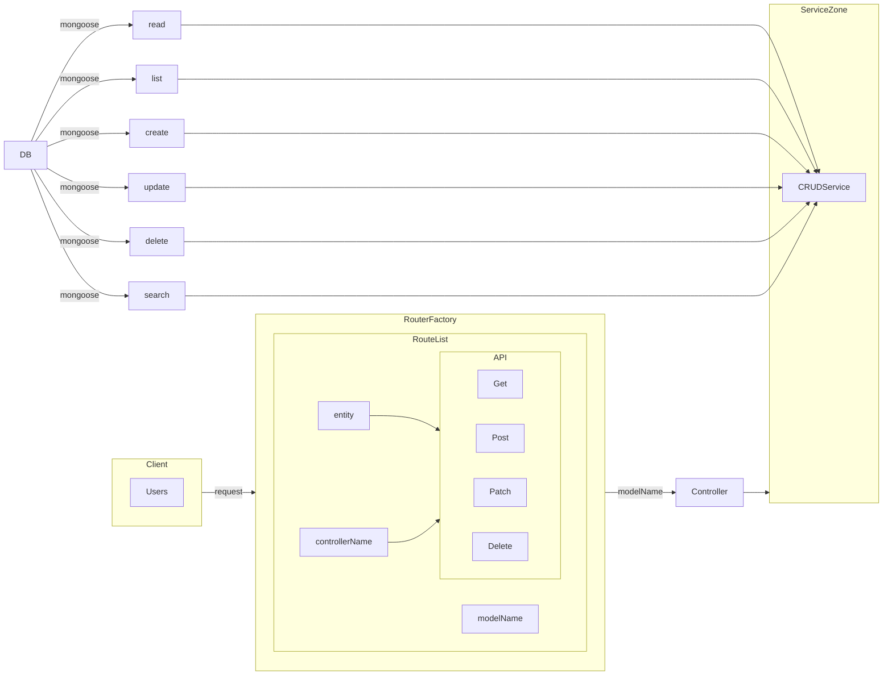

```mermaid
    flowchart LR
        subgraph Client
            Users
        end

        subgraph RouterFactory
            subgraph RouteList
                entity --> API
                controllerName --> API
                modelName
            end

            subgraph API
                Get
                Post
                Patch
                Delete
            end
        end

        RouterFactory --modelName--> Controller --> ServiceZone

        Controller

        subgraph ServiceZone
            CRUDService
        end

        read
        list
        create
        update
        delete
        search

        DB

        DB --mongoose--> read
        DB --mongoose--> list
        DB --mongoose--> create
        DB --mongoose--> update
        DB --mongoose--> delete
        DB --mongoose--> search


        read ----> CRUDService
        list ----> CRUDService
        create ----> CRUDService
        update ----> CRUDService
        delete ----> CRUDService
        search ----> CRUDService

        Client --request--> RouterFactory

```
